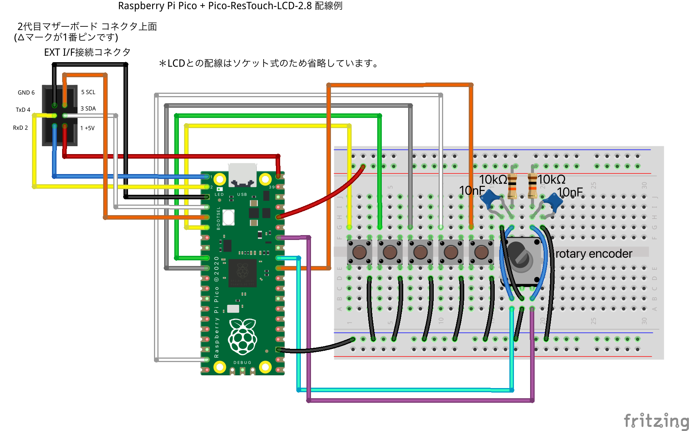
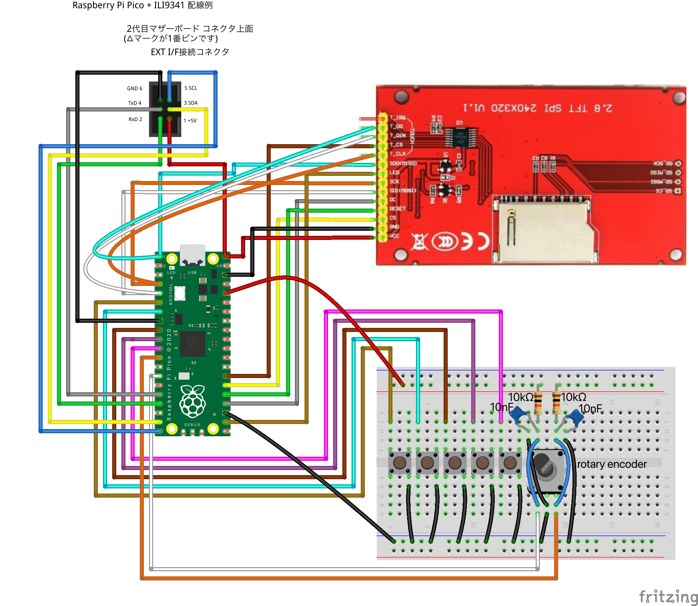
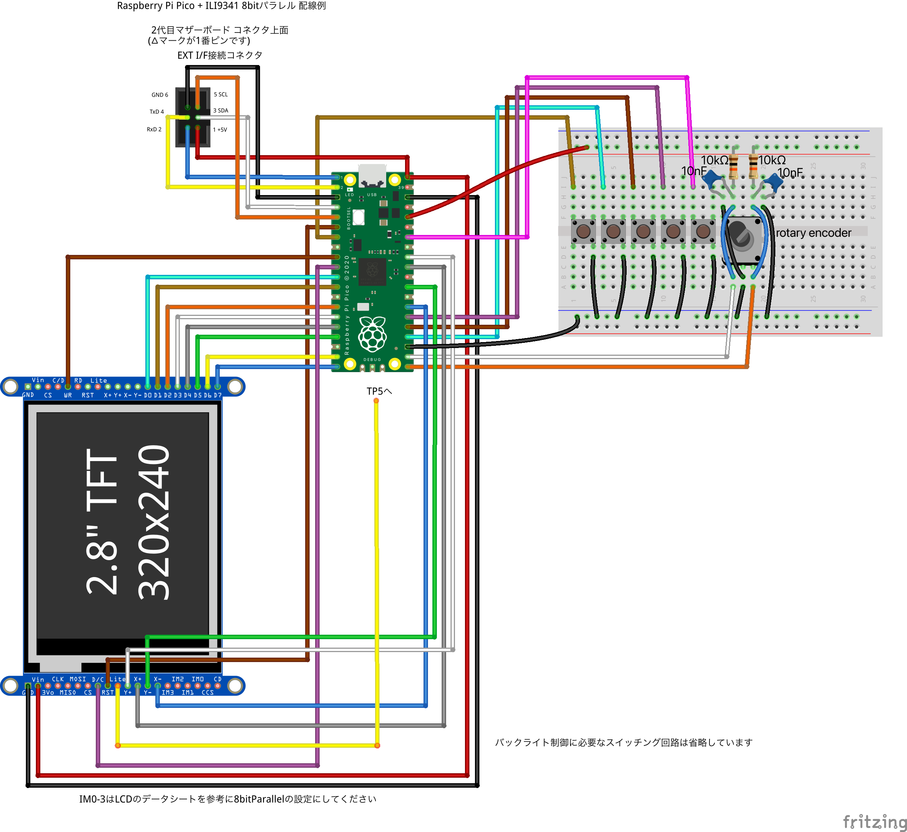

# gimicDisp LCD
多連装音源システムG.I.M.I.Cを完全なスタンドアロン動作させるためには専用液晶ユニット(GMC-OPT03)が必要です。既に生産が終了した液晶ユニットの代替品を、汎用のSPI/8bitパラレル液晶を利用して製作します。G.I.M.I.C専用液晶ユニットのエミュレーション機能+拡張機能がArduino IDEに対応した32-bitプロセッサ上で動作します。G.I.M.I.Cの液晶ユニットの仕様をアーカイブする事、また現存ユーザーが今後も液晶ユニットを作成可能にする事を目的としています。macOS/Windows版gimicDispの汎用MCU版という側面もあります。

## GMC-OPT03互換機能
G.I.M.I.Cの液晶ユニット(GMC-OPT03)は、UART接続のe-DISP3とI2C接続のI/Oエキスパンダーに接続された5つのボタンで構成されています。[参照：G.I.M.I.C公式wiki内の技術情報](#gimic公式wiki-技術資料)

gimicDisp LCDはこれらの機能を1チップでエミュレートします。
e-DISP3も既に生産が終了していますが、仕様やコマンドは[web上で公開されています。](#e-disp3-ソフトウェアマニュアル)

## 拡張機能
* タッチパネル操作に対応
* ロータリーエンコーダ操作に対応
* USB HIDデバイスの接続(Raspberry Pi Picoのみ)
* G.I.M.I.Cとの通信速度の向上

## 動作確認済みプラットフォーム
|プラットフォーム|利点|欠点|
|:--|:--|:--|
|ESP32|LCDへの転送が速い・高い処理能力|USBホスト未対応・消費電力多め|
|Raspberry Pi Pico(おすすめ)|安価・USBホスト機能・ピン数が多い|SPIの転送がやや遅い|
|M5Stack Basic|設定が簡単・液晶が綺麗|やや高価・画面が小さい・ボタンが必要|
|M5CoreS3|設定が簡単・液晶が綺麗・タッチパネル|やや高価・画面が小さい|

## 必要なコンポーネント
### Arduino IDEに対応したMCUボード
RP2040(e.g. Raspberry Pi Pico)とESP32系に対応しています。
### 320x240液晶モジュール
SPIもしくはパラレル8bit入力の、TFT_eSPI(またはLovyanGFX)ライブラリで駆動可能な液晶モジュールが必要です。詳細は[TFT_eSPIのページ](#tft_espi)や[LovyanGFX](#lovyangfx)を参照してください。
### 6ピンコネクタとケーブル
G.I.M.I.Cとボードを接続するために必要です。
[参照：G.I.M.I.C公式wiki内の技術情報](#gimic公式wiki-技術資料)
### ロータリーエンコーダ(optional)
必須ではありませんがあると便利です。
### 操作用の装置
以下のいずれかが必須です。USBデバイスをRaspberry Pi Picoに接続するにはOTGケーブルが別途必要です。
* タクトスイッチx5(推奨、ビルド済みバイナリでは必須)
* タッチパネル(LCDに付いているもの)
* USB HIDゲームパッド
* USB HIDマウス
* USB HIDキーボード

## 依存ライブラリ
以下のライブラリが必要です。Arduino IDE上のライブラリマネージャからインストールしてください。
* TFT_eSPI(またはLovyanGFX)
* M5Unified(M5Stack使用時のみ)
* Adafruit TouchScreen(4線アナログタッチパネルでなければ不要)

## 使い方
使用するにはG.I.M.I.Cのファームウェアを7.8.0以降のバージョン(現時点で未リリース)に更新する必要があります。
これ以前のバージョンでは、全ての機能が利用出来ない他、G.I.M.I.C側からの給電で動作出来ません。

### Arduino IDEのインストール
最新版のArduino IDEをインストールしてください。動作確認時点の最新版は2.3.2です。

https://www.arduino.cc/en/software
### 追加ボードのインストール
使用するボード用の環境をセットアップします。
#### Raspberry Pi Picoの場合
追加のボードマネージャURLに以下を追加してください。

`https://github.com/earlephilhower/arduino-pico/releases/download/global/package_rp2040_index.json`

その後、ボードマネージャから"Raspberry Pi Pico/RP2040 by Earle F. Philhower, III"をインストールしてください。(確認時点のバージョンは3.9.4)
#### M5Stackの場合
追加のボードマネージャURLに以下を追加してください。

`https://static-cdn.m5stack.com/resource/arduino/package_m5stack_index.json`

その後、ボードマネージャから"M5Stack by M5Stack official"をインストールしてください。(確認時点のバージョンは2.1.1)

#### ESP32の場合
追加のボードマネージャURLに以下を追加してください。

`https://espressif.github.io/arduino-esp32/package_esp32_index.json`

その後、ボードマネージャから"esp32 by Espressif Systems"をインストールしてください。(確認時点のバージョンは3.0.2)

### ライブラリのインストール
ライブラリマネージャーから以下のライブラリをインストールしてください。
* TFT_eSPI by Bodmer (確認時点では2.5.43)
* Adafruit TouchScreen by Adafruit (アナログ直結タッチパネルを使用する場合のみ。確認時点では1.1.5)
* M5Unified by M5Stack (M5Stackを使用する場合のみ。確認時点では0.1.16)
* LovyanGFX by lovyan03 (TFT_eSPIの代わりに使用出来ます。確認時点では1.1.16)

### 使用するボードとLCDに合わせた初期設定
使用する環境に合わせたコンフィグファイルを作成します。
設定の詳細は user_config フォルダ内にあるテンプレートファイルを参照してください。

G.I.M.I.Cとの接続ピンの設定や、TFT_eSPIの初期設定の方法やビルド設定なども記載されています。
使用するconfigファイルを決めたらsetup.h内でインクルードされるようにsetup.hを編集してください。
ここに無い環境の場合は、近い環境の既存ファイルを複製して作成してください。

**USBホスト機能を利用する場合は、configファイル内の説明の通りに+5Vラインを必ずVBUSに接続してください。VSYSに接続するとUSBデバイスに給電されませんのでご注意ください。**

TFT_eSPIの設定後は一度サンプルデモの動作確認をおすすめします。

LovyanGFXを利用する場合は各自でヘッダファイルを作成し、tftDispSPI.h内でインクルードしてください。lgfx_configフォルダ内にサンプルがあります。

### プログラムをボードに書き込む
Arduino IDE上でプログラムを書き込みます。
一度ボードに書き込んだ後に書き換える場合は、BOOTSELボタンを押しながらRaspberry Pi PicoをPCに接続してください。

### 配線する
user_configファイルに書かれたピン番号の通りにLCDとボードとボタン類を繋いでください。
その後、G.I.M.I.CのEXT I/Fコネクタとボードを6Pコネクタで接続してください。
EXT I/Fコネクタのピン配置は公式wiki内の[技術資料](#gimic公式wiki-技術資料)にあります。

### 動作確認
G.I.M.I.Cの接続が無い状態ではLCDのバックライトが消灯します。
初回起動時もしくはスクリーンの方向設定を変更した場合はタッチスクリーンのキャリブレーションが行われますので、画面の指示の通りに行なってください。
再度行いたい場合は、ボタン１を押しながら起動してください。
ボタンを使用できない場合は、ボード上のフラッシュメモリを初期化する事で再度キャリブレーションを行えます。
https://www.raspberrypi.com/documentation/microcontrollers/raspberry-pi-pico.html#software-utilities
ロータリーエンコーダーのピンを有効化している場合は、次の画面で、クリック数、方向の設定を行います。
この設定は、RENC_CLICKS_PER_PULSEを定義するとスキップできます。
再度行いたい場合は、ボタン２を押しながら起動してください。

Raspberry Pi Picoの場合、G.I.M.I.CがLCDを認識するとボード上のLEDが点灯します。

USB HIDデバイスを使用する場合は市販のOTGケーブルを用いて接続してください。

## 配線例

### Raspberry Pi Pico + PicoResTouch-LCD-2.8(ST7789)
詳細はuser_config/rpipico_PicoResTouch_2_8.h を参照してください。

### Raspberry Pi Pico + ILI9341(SPI)
詳細はuser_config/rpipico_ILI9341_spi.h を参照してください。

### Raspberry Pi Pico + ILI9341(8bit Parallel)
詳細はuser_config/rpipico_ILI9341_parallel.h を参照してください。

## なぜ作ったのか？
G.I.M.I.CのMIDI機能は元々、LCDの利用を前提とした5ボタン操作を想定した設計で、e-DISPのグラフィック機能を必要とするものでした。しかし、e-DISP3の生産が終了となり、後継品は仕様的に適合しない事が分かり、PC環境での使用も考慮する必要が出てきました。当初はPC接続にはteraTermが使われていましたが、e-DISPのようなグラフィック機能はありませんので、そのままではフル機能が使えません。そのため、macOS/Windows版gimicDispを作成しました。その後MIDI機能はリリースされましたが、元々LCD用の設計だっただけに、PCでの使用に必ずしも最適ではないUXであるPC版の方が多く利用されている状況を何とかしたいと思い、gimicDispのMCU版を作成する事にしました。

## 動作確認済みコンポーネント
Raspberry Pi Pico
https://www.switch-science.com/products/6900

ESP32-DevKitC-32
https://akizukidenshi.com/catalog/g/g115673/
RAM：520kB品で大丈夫です。

Pico-ResTouch-LCD-2.8
https://www.switch-science.com/products/7331
Raspberry Pi Pico用ソケット付きです。若干青みがかっていますがIPS液晶なので見やすいです。

MSP2807
https://akizukidenshi.com/catalog/g/g116265/
安価ですが機能は満たしています。

SX032QVGA008(タッチ付き)
https://www.aitendo.com/product/21022
大きめのサイズが欲しい人に。パラレル接続すると描画が非常に高速です。

ロータリーエンコーダー(ボタン付き)
https://tech.alpsalpine.com/j/products/detail/EC12D1524403/
回転がスムーズでおすすめのモデルです。ボタン付きなので５つ目のボタンを兼ねさせられます。

ロータリーエンコーダー
https://akizukidenshi.com/catalog/g/g100292/
しっかりしたクリック感です。問題なく使えます。

ロータリーエンコーダー(ノンクリックタイプ)
https://akizukidenshi.com/catalog/g/g106358/
回転が少し重めでした。クリック有りタイプの方が良いかもしれません。

タクトスイッチ
https://www.aitendo.com/product/19799
ボタン用のスイッチは好みで選んで良いでしょう。

USBゲームパッド
https://www.amazon.co.jp/dp/B00RF10Z3O
DirectInput系であればボタン配置の変更で他の機種にも対応出来るはずです。

DUALSHOCK 4 コントローラー
https://www.amazon.co.jp/dp/B01LPTFJ8W
一応使えます。

Joy-Con、DualSense Edge、DualSense、FirebirdV2、STADIA Controllerその他**XInput系コントローラーは非対応です。**

USBキーボードは日本語配列にのみ対応しています。PC版gimicDispと同等の操作になります。
マウス操作もPC版gimicDispと同等です。

## 参考資料
### G.I.M.I.C公式wiki 技術資料
https://gimic.jp/?技術資料
### e-DISP3 ソフトウェアマニュアル
https://www.ddl.co.jp/shop/html/products/detail/3
### Arduino-Pico — Arduino-Pico 3.6.0 documentation
https://arduino-pico.readthedocs.io/en/latest/
### ESP32 Arduino Core’s documentation
https://docs.espressif.com/projects/arduino-esp32/en/latest/
### M5Stack Arduino Guide
https://docs.m5stack.com/ja/arduino/arduino_ide
### TFT_eSPI
https://github.com/Bodmer/TFT_eSPI
### LovyanGFX
https://github.com/lovyan03/LovyanGFX
### RP2040 (Pico): Over-clocking and SPI maximum frequency
https://github.com/Bodmer/TFT_eSPI/discussions/2432
### bdf2bmp
http://hp.vector.co.jp/authors/VA013241/font/bdf2bmp.html
### ロータリー・エンコーダの使い方
http://elm-chan.org/docs/tec/te04.html
### Pico-ResTouch-LCD-2.8
https://www.waveshare.com/wiki/Pico-ResTouch-LCD-2.8
### Device Class Definition for Human Interface Devices (HID)
https://www.usb.org/sites/default/files/hid1_11.pdf
### レポートディスクリプタ - おなかすいたWiki！
https://wiki.onakasuita.org/pukiwiki/?レポートディスクリプタ
### USB HID Usage ID の Scancode 変換と対応するキー
https://bsakatu.net/doc/usb-hid-to-scancode/
### USBキーボードのキーコード
https://www2d.biglobe.ne.jp/~msyk/keyboard/layout/usbkeycode.html

## 使用フォント
### 美咲ゴシック 2012-06-03 版
https://littlelimit.net/misaki.htm

These fonts are free softwares.
Unlimited permission is granted to use, copy, and distribute it, with or without modification, either commercially and noncommercially.
THESE FONTS ARE PROVIDED "AS IS" WITHOUT WARRANTY.

これらのフォントはフリー（自由な）ソフトウエアです。
あらゆる改変の有無に関わらず、また商業的な利用であっても、自由にご利用、複製、再配布することができますが、全て無保証とさせていただきます。

Copyright(C) 2002-2012 Num Kadoma

### M+ BITMAP FONTS
https://github.com/coz-m/MPLUS_FONTS/blob/master/obsolete/mplus_bitmap_fonts-2.2.4.tar.gz

M+ BITMAP FONTS            Copyright 2002-2005  COZ <coz@users.sourceforge.jp>

LICENSE

These fonts are free softwares.
Unlimited permission is granted to use, copy, and distribute it, with
or without modification, either commercially and noncommercially.
THESE FONTS ARE PROVIDED "AS IS" WITHOUT WARRANTY.

### 東雲フォント 16ゴシック
http://openlab.ring.gr.jp/efont/shinonome/

Public Domain

## 謝辞
TFT_eSPI
https://github.com/Bodmer/TFT_eSPI
このライブラリの存在によって実現可能性を見出せました。

tinyUSB
https://github.com/hathach/tinyusb
実装が煩雑なUSBホストの実装を簡便に行う事が出来ました。

rgb565-converter
https://github.com/CommanderRedYT/rgb565-converter
多量の画像データの変換を効率的に行う事が出来ました。

G.I.M.I.CのLCDの仕様に関する情報提供を頂いたG.I.M.I.C Projectメンバー一同に感謝します。

G.I.M.I.Cを愛用する方々

## 注意事項
本ソフトウェアはe-DISP3の仕様を元にG.I.M.I.C向けに最適化したものであり、e-DISPの代替となる事は目指していません。そのため、G.I.M.I.Cが使用しない一部の仕様には未対応です。
本ソフトウェアを元にした製作物は商用非商用問わず無償で自由に改変、使用が可能です。ただし、動作の保証に関しては製作される方に帰属するものとします。当方はプロの回路技術者でも無ければプログラマでもありません。機能の改善に関するご協力は歓迎いたします。